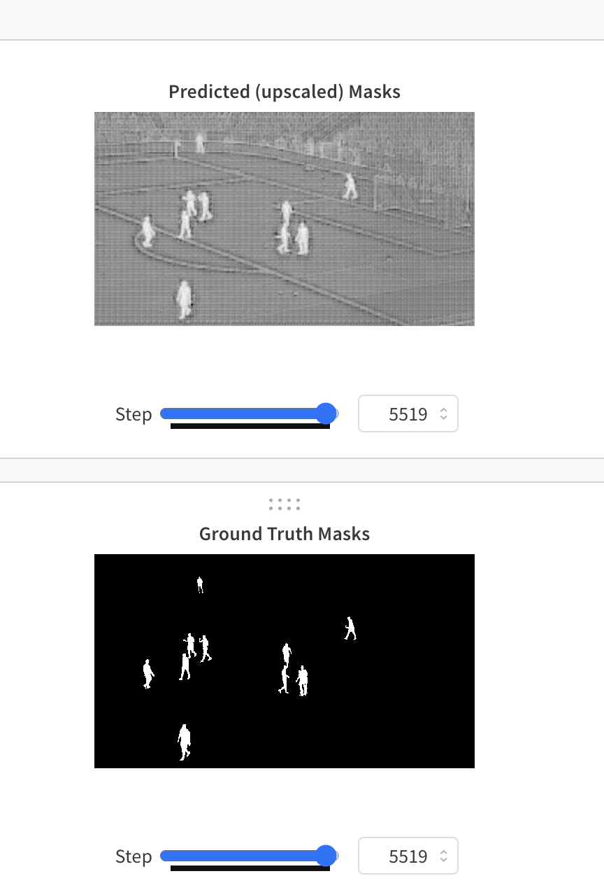
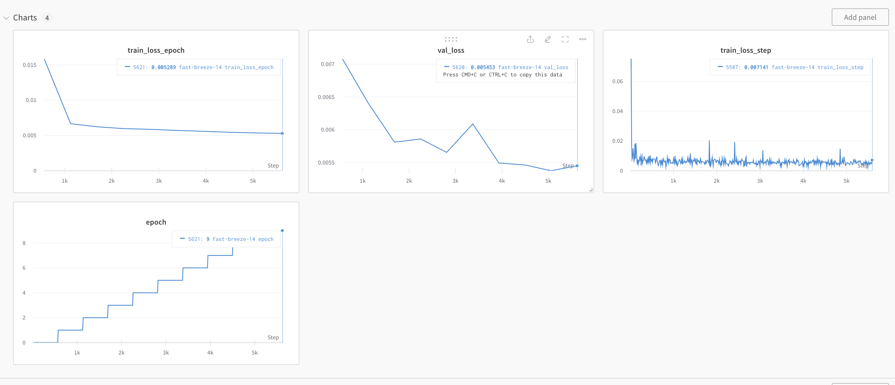
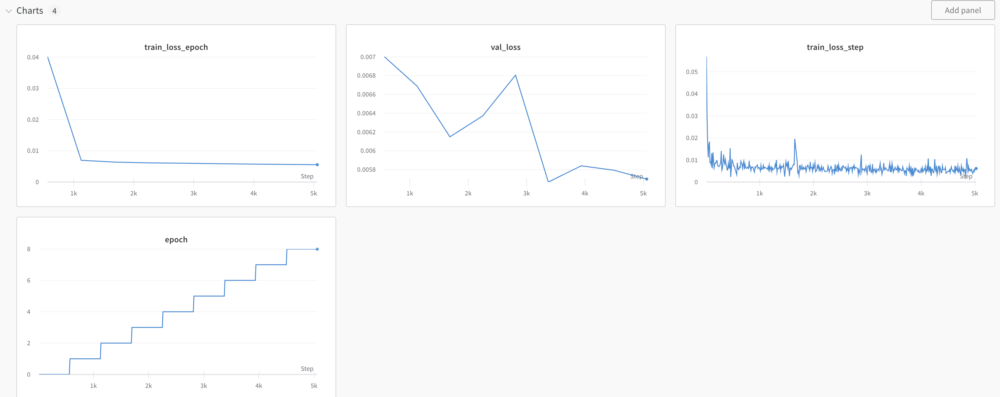
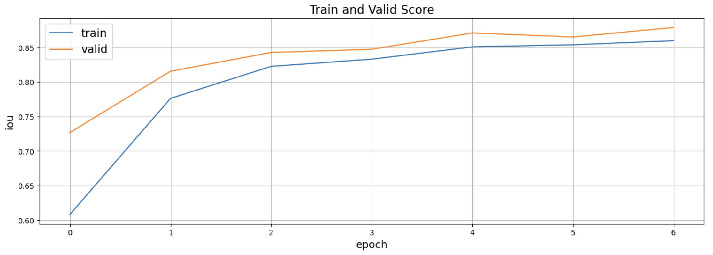

### player_segmentation
Playground for several instance segmentation algos

### This repo contains :
1. Unet Notebook training on player segmentation dataset
2. Segment Anything(SAM) Notebook training on player segmentation dataset
3. Script for frame extraction from video
4. Script to generate video from consecutive frames
5. Inference scripts
6. Various debugging scripts

### Ideas to improve the segmentation for the players overlapping the LED:

	1.	in my opinion the led segmentation masks, would help the model better clasify the pixels belonging to the players vs led - should be explored the idea to add led segmentation masks
 	2.	add external images / increase dataset
	3.	analysis of the samples where we have biggest segmentation fauls. Probably post processing here can help. find Contours/ convex hull can help
	4.	fine tune the model ideas: 
 		- data augmentations : RGB shift, Random Brightness Contrast, Hue Saturation Value, deformation, color, blur, deformation, rotations
   		- play with resolution input try different resolutions as input to model
		- try different LR schedullers
  		- stochastic weight averadging
    	- test time augmentation, not very commercial friendly
       	- try different model optimisers
    	- try multiple losses / weighted loss
	5.	split the big picture in smaller images, around the players that overlap the signs could potentially output a better segmentation, using SAM
	6.	in order to avhieve step 4 we need to find a way to cluster players of interest vs. player not in the area of interest. my expectation is we can use model embeddings, maybe extracted with bbox-es arround the players. Clasification or clusterring of these model embeddings should help
 	7.	business specific requirements: depends on non functional requirements like model size, hardware various experiments can be tried.
  	8.	combine another decoder with sam encoder. (extract features with pretrained SAM, maybe experiment a bit with prompt encoder as well, and experiment by customizing the SAM decoder). Ensambles ?? 
   	9	Research on a better SAM fine-tune procedure.
  
### SAM training - weights and biasses screenshot
mask vs predicted - vizualisation

Session 2 Training

Session 1 Training

### Unet training

